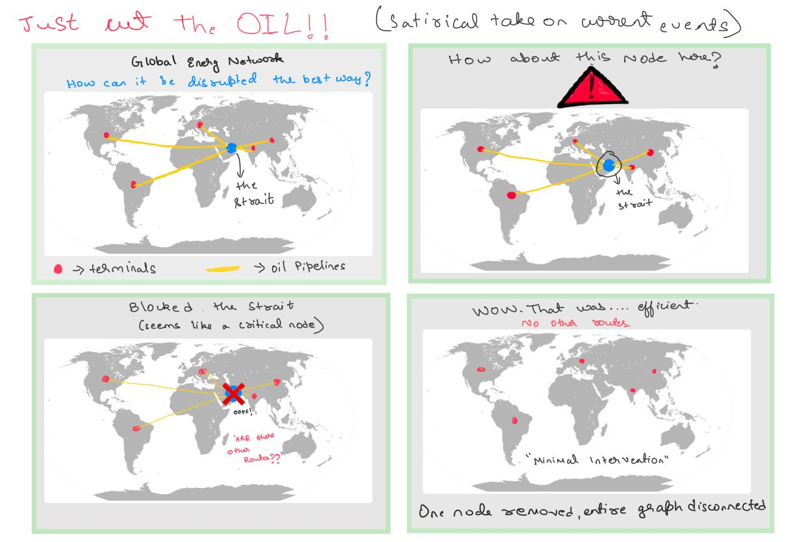

# Algorithm Engineering Exam
Student Name: Jyotsna Bellary

Student Id: 01/1472532
## Minimum Node Multiway Cut Problem 

The Multiway Cut Problem(MCP) is a graph partitioning and combinatorial optimization problem in computer science. Given a graph and a set of terminal nodes, a Node Multiway cut is a set of minimum vertices that leaves terminals disconnected from each other when removed from the graph.

In this project we compare and analyze the following approaches to solve the Node Multiway Cut Problem
- A greedy heuristic algorithm (Isolation Cut Heuristuc)
- A parallelised heuristic algorithm 
- A (2 - 2/k) approximation approach
- An improved parameterized exact algorithm

### A comic to describe the problem


### Prerequisites

Before building this project, make sure the following are installed:

- **CMake 3.16 or newer**
- **A C++17-compatible compiler** (`g++`, `clang++`, or MSVC)
- **OpenMP** development support
- **GLPK** library and development headers

```bash
sudo apt update
sudo apt install -y cmake g++ libglpk-dev
sudo apt install -y libomp-dev
```

## Build
Configure the build directory once:
```bash
cmake -S . -B build -DCMAKE_BUILD_TYPE=Debug
cmake --build build -j
```

After the initial CMake configure, you can optionally rebuild with:
```bash
./build.sh
```

Run the CLI binary:
```bash
build/multiwaycut
```

